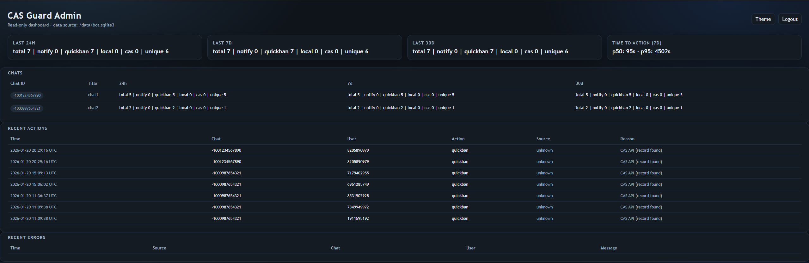

# TG CAS Guard Bot

Anti-spam bot for Telegram groups with hybrid detection:
- Local blacklists (CAS export.csv + lols.bot scammers.txt)
- CAS API check on demand

## Features
- Per-chat modes:
  - /notify (report only)
  - /quickban (ban + delete cached messages)
- Updates sources every 30m (configurable)
- Rechecks seen users every N (e.g. 15m)
- Deduplicates actions per user (no repeated notifications/bans)
- Whitelist/unban:
  - /unban <userid> (adds to whitelist for this chat + tries to unban)
- Status:
  - /status (bot status, mode, intervals, local DB size)
- Stats:
  - /stats (24h / 7d / 30d counts)
- CAS checks are cached for a short TTL to reduce API load.
- Optional admin dashboard (read-only) with per-chat stats, recent actions, and source refresh times.



## Requirements (Telegram)
Bot must be admin with:
- Ban users
- Delete messages

Also disable Privacy Mode in BotFather to receive all messages:
BotFather -> /setprivacy -> Disable

## Run (Docker)
1) Copy `.env.example` to `.env`, set BOT_TOKEN
2) `docker compose up -d --build`

### Admin dashboard (optional)
1) Set in `.env`:
   - `ADMIN_ENABLED=true`
   - `ADMIN_AUTH_MODE=token|telegram|both`
   - `ADMIN_TOKEN=...` (Bearer token, required for token mode)
   - `ADMIN_PORT=9005`
2) Start with profile:
   - `docker compose --profile admin up -d --build`
3) Open: `http://<host>:9005/`
   - Send header: `Authorization: Bearer <ADMIN_TOKEN>`

Note: The admin service is intended to run behind a reverse proxy (HTTPS). This is required for Telegram login and secure cookies. If you do not use Telegram login, you can access it directly on `http://<host>:9005/` with token auth.

#### Telegram login (optional)
If `ADMIN_AUTH_MODE` includes `telegram`:
1) Set in `.env`:
   - `ADMIN_PUBLIC_URL=https://your-domain`
   - `ADMIN_TELEGRAM_BOT_USERNAME=your_bot_username`
   - `ADMIN_TELEGRAM_BOT_TOKEN=` (optional, defaults to `BOT_TOKEN`)
   - `ADMIN_TELEGRAM_IDS=123,456` (allowed Telegram user IDs)
   - `ADMIN_SESSION_SECRET=...`
   - `ADMIN_TELEGRAM_AUTH_MAX_AGE_SEC=86400` (max age of login payload)
2) In BotFather, set domain: `/setdomain` to your `ADMIN_PUBLIC_URL` host.
3) Open `https://your-domain/login` and authenticate.

### Backup / Restore
The bot uses SQLite stored in `./data/bot.sqlite3`.

Backup:
```bash
docker compose down
tar -czf cas-guard-backup.tgz data/
```

Restore on a new server:
1) Copy `cas-guard-backup.tgz` and the repo to the new server.
2) Extract:
```bash
tar -xzf cas-guard-backup.tgz
```
3) Ensure `.env` is configured and start:
```bash
docker compose up -d --build
```

Logs:
- SQLite: ./data/bot.sqlite3
- Ban/notify audit log: ./data/banned.txt

Stats:
- Stored in SQLite action_log table and pruned with seen TTL.
